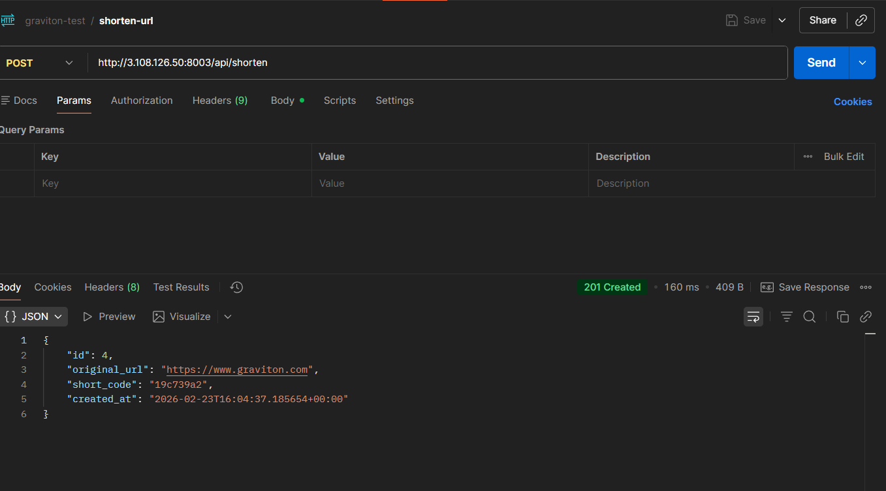
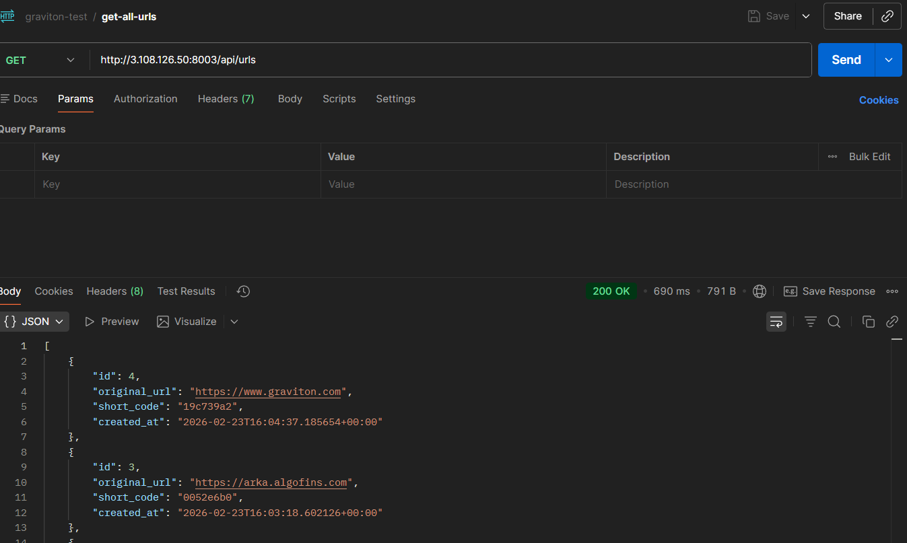

# URL Shortener API

A URL shortening application implemented in three Python web frameworks: **Flask**, **Django**, and **FastAPI**.

## Features

- Shorten long URLs using MD5-based short codes
- Validate URLs before shortening
- Store shortened URLs in SQLite (via SQLAlchemy)
- Redirect short codes to original URLs

## API Endpoints

| Method | Endpoint | Description |
|--------|----------|-------------|
| GET | `/api/urls` | Get all created shortened URLs |
| POST | `/api/shorten` | Shorten a URL (body: `{"url": "https://example.com"}`) |
| GET | `/{short_code}` | Redirect to original URL |

## Setup

```bash
make install   # Creates venv and installs dependencies
```

## Running the App

### Run all 3 apps together (background)
```bash
make run-all    # Starts Flask (8002), Django (8003), FastAPI (8004)
make stop-all   # Stops all servers
```

### Run individually (foreground)
| Framework | Port | Command |
|-----------|------|---------|
| Flask | 8002 | `make run-flask` |
| Django | 8003 | `make run-django` |
| FastAPI | 8004 | `make run-fastapi` |

## Running Tests

```bash
# All tests
make test

# Individual framework tests
make test-flask
make test-django
make test-fastapi
```

## Usage Examples

### 1. Shorten a URL

```bash
curl -X POST http://localhost:8000/api/shorten \
  -H "Content-Type: application/json" \
  -d '{"url": "https://example.com"}'
```



### 2. Get all URLs

```bash
curl http://localhost:8000/api/urls
```



### 3. Redirect to Original URL

```bash
curl -L http://localhost:8000/abc12345
```


## Project Structure

```
├── common/
│   └── utils.py          # short_code(), is_valid_url()
├── flask_app/
│   ├── app.py
│   └── models.py
├── django_app/
│   ├── manage.py
│   ├── django_app/
│   └── shortener/
├── fastapi_app/
│   ├── app.py
│   └── models.py
├── tests/
├── Makefile
├── requirements.txt
└── README.md
```
